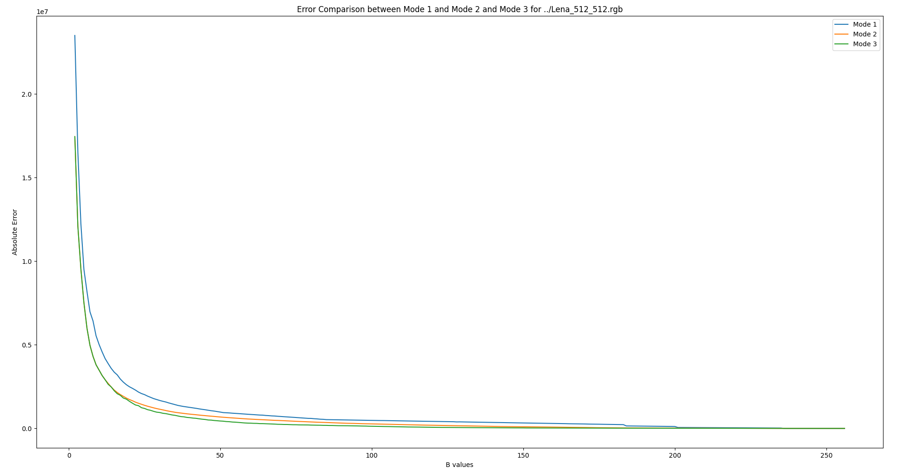
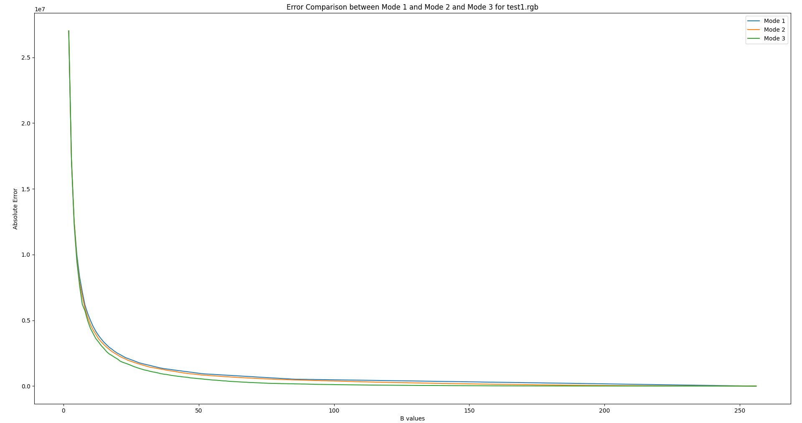
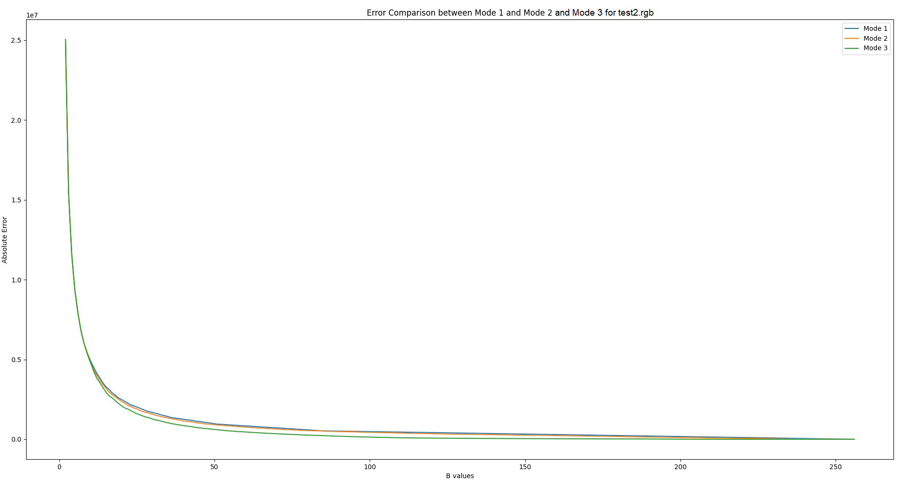
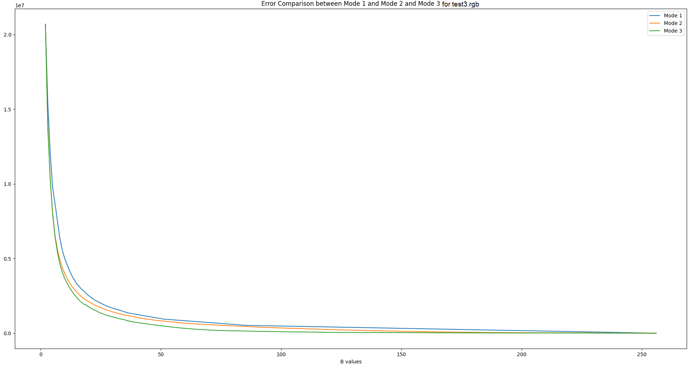
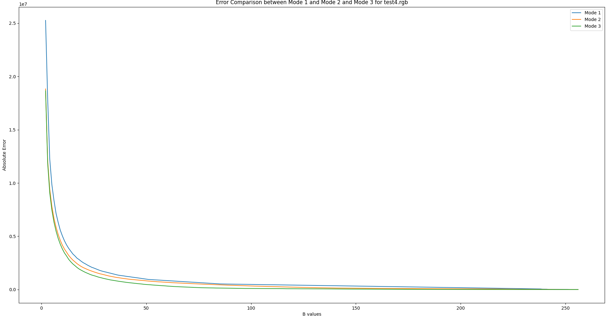
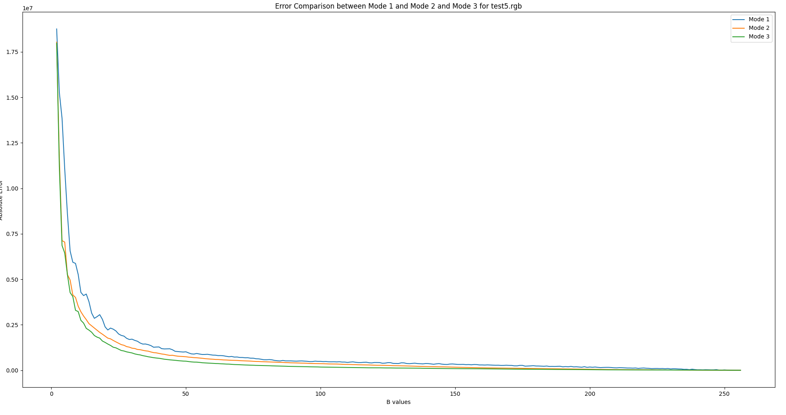

# Colorful Adventures in Pixeland: A Quantization Odyssey

Prachotan Bathi

Here’s some interesting insights from this assignment

Mode 2 always performed at least as well as Mode 1, better in most scenarios.

Similarly Mode 3 always performed at least as well as Mode 2, better in most scenarios.

### Performance

Mode 3, involving non-uniform quantization with varying bucket numbers across channels, tends to outperform Mode 2 and Mode 1 due to its flexibility in adapting to the inherent color distribution of an image. By allowing each channel to have a different number of buckets based on their characteristics, Mode 3 provides a more tailored and nuanced approach to quantization.

Mode 2, which employs non-uniform quantization but with an equal number of buckets for each channel, still captures some of the image's intricacies. However, it might fall short in scenarios where specific channels exhibit significantly varying color distributions. The fixed number of buckets across channels in Mode 2 may not effectively capture the nuances of each color channel.

On the other hand, Mode 1 employs uniform quantization, dividing each channel into an equal number of buckets with equal spacing. While this approach simplifies quantization, it may struggle to represent images with complex and varied color distributions accurately. The lack of flexibility in adapting to channel-specific characteristics could lead to quantization errors.

In summary, the hierarchical performance of Mode 3 > Mode 2 > Mode 1 can be attributed to the increasing adaptability and customization each mode offers in capturing the unique features of an image's color composition.

Here’s a close-up look at error propagation for the Lena image:


We can observe a substantial reduction in error from Mode 1 to Mode 2 to Mode 3

There are instances where all three modes perform equally bad (or good). This could be attributed to uniform color distribution or equal channel contribution, further propelled by the intricacies of using integer types at places unavoidable, leading to all three modes converging to similar bucket sizes or ranges.

### Convergence speeds Mode 1 to Mode 2 to Mode 3

Mode 1 to Mode 2:

The convergence from Mode 1 to Mode 2 might exhibit a change in speed due to the introduction of non-uniform quantization in Mode 2. Non-uniform quantization allows for adjustments to the bucket sizes based on the color distribution in each channel.
If the image has distinct color regions that benefit from different bucket sizes, Mode 2 may converge faster than Mode 1, as it can adapt more flexibly to the color variations.

Mode 2 to Mode 3:

The transition from Mode 2 to Mode 3 involves introducing varying bucket numbers across channels in addition to non-uniform quantization. The increased flexibility in Mode 3 allows for a more precise allocation of buckets to each channel based on its contribution to the overall image.
Mode 3 might converge faster than Mode 2 if the image has significant variations in color distributions across channels, and assigning different bucket numbers proves advantageous.

Factors Influencing Convergence:

The complexity of the image can influence the convergence speed, the presence of dominant colors, and the effectiveness of the algorithms used in each quantization mode.
Mode 3 might converge faster in most cases due to its ability to tailor the quantization process to individual channel characteristics, reducing overall error more efficiently.

It is essential to observe that the general performance and convergence tend to draw closer to each other as the number of buckets gets closer to the number of distinct color values.

### Mode 3 approach:

For mode 3, this suggestion from the assignment document inspired me:

> Non uniform and varying number of buckets across different channels. For example, if an image is red dominant and you are provided with 125 buckets, you can assign 25 buckets to red, 5 to green and 1 to blue. This way you can reduce the overall error after quantization since you can more precisely quantize the red in the image. The number of buckets in each channel is an optimization process.
> 

Let’s say the input is B($b^3$). We can establish that 3*b is always less than $b^3$.

My first step is to find the weighted averages of each channel. Then, based on the weighted averages, I distributed the 3*b buckets proportionately to the red, green, and blue channels.

The next step was to optimize.

I iteratively found the difference between the product of the distributed number of buckets per channel (say, r buckets for Red, g buckets for Green, and b buckets for Blue).

                                                   $diff=b^3 - r.g.b$

Based on the diff, if buckets were still available, I distributed them back to the channels iteratively until diff≤0. 

This helped me allocate the most buckets to the channel that needed them and also allowed me to utilize all the remaining buckets efficiently.

Further, an interesting approach is that, Mode 2 and Mode 3 have similar errors for smaller bucket sizes, since Mode 3 is inherently using the same mechanism for setting the buckets for a given number of buckets per channel. At smaller bucket values it is possible that Mode 3 decides on allocating equal number of buckets per channel is the best approach and thus produces similar error compared to Mode 2.

The error plots for all three modes for the given dataset of test images are presented below; these images are also included separately for your reference.

## Usage

To use the program, compile the Java file and run the compiled class with the following command:

```bash
javac ImageDisplay.java
java ImageDisplay [image_path] [mode] [totalbuckets]
```

Replace `[image_path]`, `[mode]`, and `[totalbuckets]` with the appropriate values. The program validates the input parameters. An error message is displayed if the parameters are invalid, and the program exits.

In addition, I’ve also provided a Python script that automates the process of generating these plots by calling the Java executable across all modes. To use this script, uncomment line **596** (System.exit(0)) in the submitted Java code. This will ensure that your screen is not filled with 256*3 quantized images. Also, ensure to change the image path.

Lena



test1.rgb



test2.rgb



test3.rgb



test4.rgb



test5.rgb

